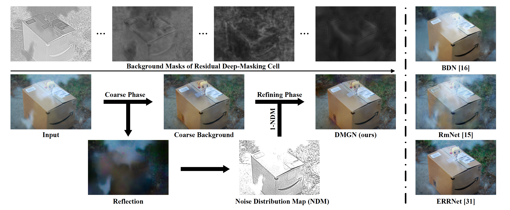
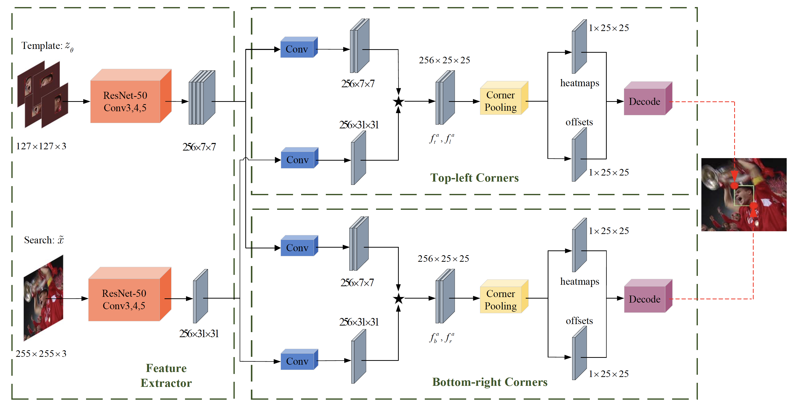
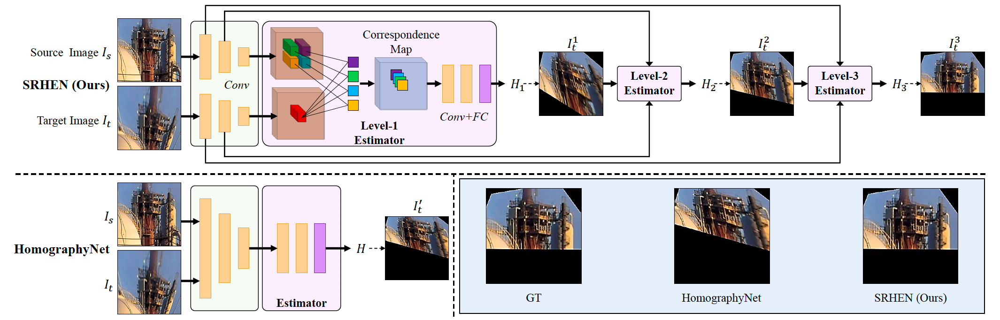
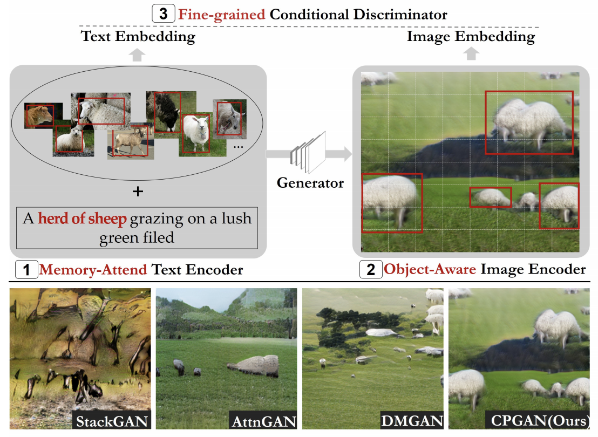
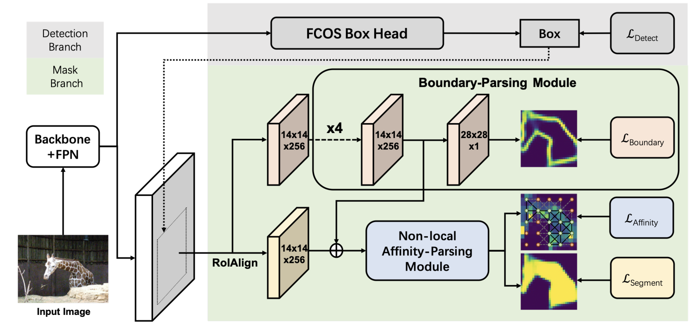
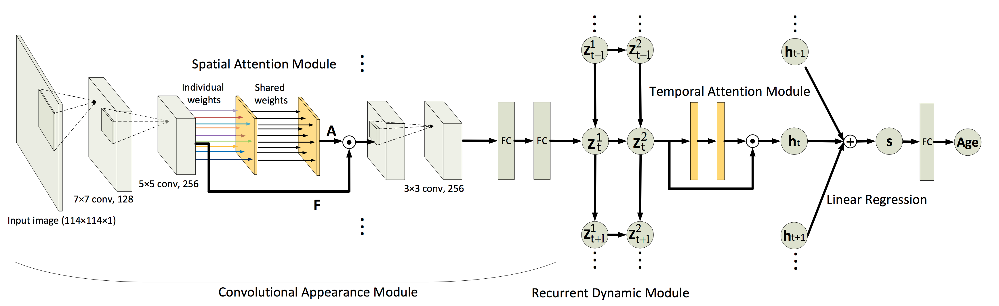
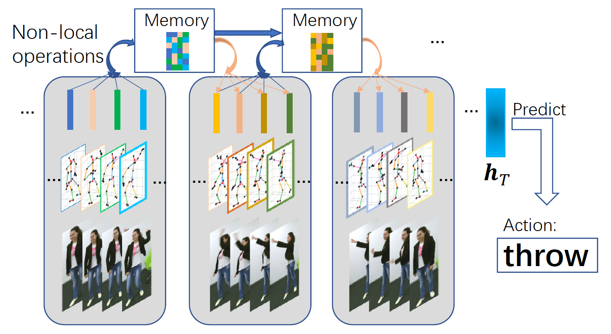
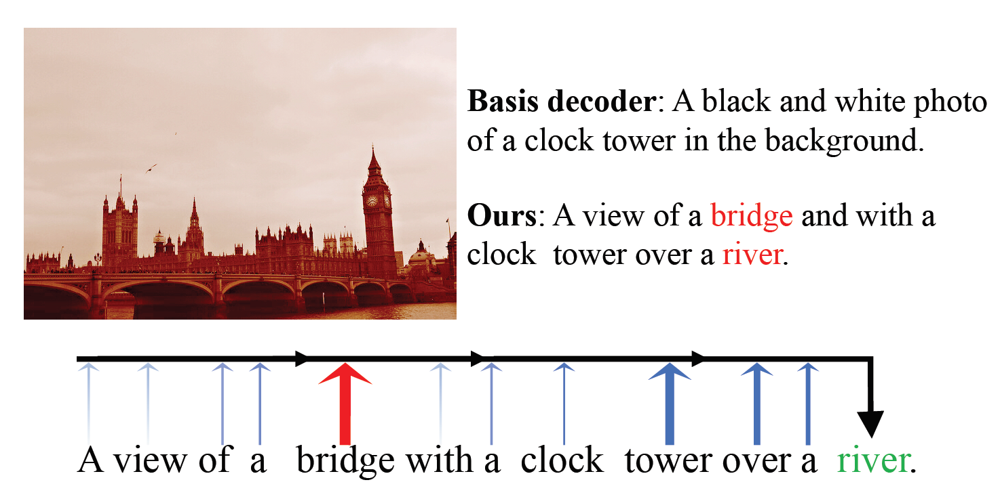

## Contact

Yunqiang Li  
PhD candidate of the <a href="http://visionlab.tudelft.nl">Computer vision lab</a> 
Faculty of Electrical Engineering, Mathematics and Computer Science 
Delft University of Technology

<b>Email:</b> y.li-19@tudelft.nl   
<b>github:</b> <a href="https://github.com/liyunqianggyn">https://github.com/liyunqianggyn</a>  

## News
* 12/2020, one paper was accepted by Association for the Advancement of Artificial Intelligence (__AAAI__).
* 07/2020, two papers were accepted by International Conference on Pattern Recognition (__ICPR__).
* 06/2019, one paper was accepted by Transactions on Multimedia (__TMM__).
* 07/2019, one paper was accepted by British Machine Vision Virtual Conference (__BMVC, oral__).

## Review

- 2021   Reviewer of International Conference on Computer Vision (ICCV)
- 2021   Reviewer of IEEE Conference on Computer Vision and Pattern Recognition (CVPR)
- 2021   Reviewer of Winter Conference on Applications of Computer Vision (WACV) 
- 2020   Reviewer of IEEE Conference on Computer Vision and Pattern Recognition (CVPR)
- 2020   Reviewer of British Machine Vision Virtual Conference (BMVC)
- 2019   Reviewer of British Machine Vision Virtual Conference (BMVC)

## Education
* 02/2018 - Now: __Delft University of Technology (TU Delft)__, Netherlands.  
  __PhD__ candidate in <a href="http://visionlab.tudelft.nl">Computer Vision Lab</a>  
  Research area: Deep Learning and Computer Vision.
* 03/2017 - 02/2018: __Xi’an Jiaotong University (XJTU)__, China.  
  __PhD__ candidate. 
* 09/ 2014 - 12/2016: Joint education of __Xi’an Jiaotong University (XJTU) and Air force Engineering__, China.  
  __Master__ of Signal and Information Processing.  

<!-- ## Experience
- 07/2018 - 12/2019, __Tencent Youtu X-Lab__.  
  Senior Researcher.
- 07/2016 - 12/2016, __Carnegie Mellon University__.  
  Visiting Scholar in Language Technolgy Institute (LTI).  
  Supervisors: [Prof. Louis-Philippe Morency](https://www.cs.cmu.edu/~morency/) and [Dr. Tadas Baltrušaitis](https://www.cl.cam.ac.uk/~tb346/).
- 03/2013 - 08/2013, Intern at __Philips Research Eindhoven__.
 -->
<!-- ## Research Interest
- Image Synthesis
- video/image captioning
- Sequence (Time Series) Modelling
- Recurrent Neural Networks
- Attention Model
- Deep Learning
- Sequence-related applications, e.g, age estimation from facial videos
- Object Detection
- Person Re-Identification
- Hashing for Image Retrival -->

## Publications 

------------------------------------------------------------------------------------------------------------------------------ 

- &emsp;Xin Feng, __Wenjie Pei__\*, Zihui Jia, Fanglin Chen, David Zhang, Guangming Lu\*. (\* corresponding authors.)  
&emsp;[Deep-Masking Generative Network: A Unified Framework for Background Restoration from Superimposed Images](https://arxiv.org/abs/2010.04324).  
&emsp;IEEE Transactions on Image Processing (__TIP__), 2021.  
 
&nbsp;

------------------------------------------------------------------------------------------------------------------------------

- &emsp;Kai Yang, Zhenyu He\*, __Wenjie Pei__\*, Zikun Zhou, Xin Li, Di Yuan, Haijun Zhang. (\* corresponding authors.)  
&emsp;[SiamCorners: Siamese Corner Networks for Visual Tracking](https://arxiv.org/abs/2104.07303).  
&emsp;IEEE Transactions on Multimedia (__TMM__), 2021.  
 
&nbsp;

------------------------------------------------------------------------------------------------------------------------------

- &emsp;Weinong Wang, __Wenjie Pei__\*, Qiong Cao, Shu Liu, Guangming Lu and Yu-Wing Tai. (\* corresponding author.)  
&emsp;[Push for Center Learning via Orthogonalization and Subspace Masking for Person Re-Identification](https://arxiv.org/abs/1908.10535).  
&emsp;IEEE Transactions on Image Processing (__TIP__), 2021.  
 
&nbsp;

------------------------------------------------------------------------------------------------------------------------------

- &emsp; Yi Li, __Wenjie Pei__* and Zhenyu He*. (* Joint corresponding authors.)  
&emsp;[SRHEN: Stepwise-Refining Homography Estimation Network via Parsing Geometric Correspondence in Deep Latent Space](coming soon).  
&emsp;__ACM MM__, 2020.  
   
&nbsp;  

------------------------------------------------------------------------------------------------------------------------------ 
- &emsp; Jiadong Liang#, __Wenjie Pei__# and Feng Lu. (# Equal contribution.)  
&emsp;[CPGAN: Full-Spectrum Content-Parsing Generative Adversarial Networks for Text-to-Image Synthesis](https://arxiv.org/pdf/1912.08562.pdf).  
&emsp;__ECCV__  Spotlight, (5% acceptance rate), 2020.  
&emsp;[\[Code\]](https://github.com/dongdongdong666/CPGAN)
     
&nbsp;  

------------------------------------------------------------------------------------------------------------------------------ 
- &emsp; Qi Fan, Lei Ke, __Wenjie Pei__\*, Chi-Keung Tang and Yu-Wing Tai. (\* Corresponding author.)  
&emsp;[Commonality-Parsing Network across Shape and Appearance for Partially Supervised Instance Segmentation](/publication/CPMask.pdf).  
&emsp;__ECCV__, 2020.  
   
&nbsp;  

-----------------------------------------------------------------------------------------------------------------------------

- &emsp;__Wenjie Pei__, Hamdi Dibeklioğlu, Tadas Baltrušaitis and David M.J. Tax.  
&emsp;[Attended End-to-end Architecture for Age Estimation from Facial Expression Videos](https://arxiv.org/pdf/1711.08690.pdf).  
&emsp;IEEE Transactions on Image Processing (__TIP__), 2020.  
 

---------------------------------------------------------------------------------------------------------------------------- 
- &emsp;Canmiao Fu#, __Wenjie Pei__#, Qiong Cao, Chaopeng Zhang, Xiaoyong Shen, Yong Zhao and Yu-wing Tai. (#both authors contributed equally).  
&emsp;[Non-local Recurrent Neural Memory for supervised Sequence Modeling](https://arxiv.org/abs/1908.09535).  
&emsp;__ICCV__ Oral, (4.3% acceptance rate), 2019.  
  
&nbsp;

---------------------------------------------------------------------------------------------------------------------------- 
- &emsp;Lei Ke, __Wenjie Pei__, Ruiyu Li, Xiaoyong Shen and Yu-wing Tai. (This work is conducted by my intern Lei under my supervision).  
&emsp;[Reflective Decoding Network for Image Captioning](https://arxiv.org/abs/1908.11824).  
&emsp;__ICCV__, 2019.  
  
&nbsp;

---------------------------------------------------------------------------------------------------------------------------- 
- &emsp;__Yunqiang Li__#, Wenjie Pei#, Yufei Zha and Jan van Gemert (#both authors contributed 
&emsp;equally).  
&emsp;[Push for Quantization: Deep Fisher Hashing](https://arxiv.org/abs/1909.00206).  
&emsp;British Machine Vision Conference (__BMVC__) Oral, (4.7% acceptance rate), 2019.  
&nbsp;
-----------------------------------------------------------------------------------------------------------------------------

<!-- ## Academic Services
Serve as reviewers for:
- Conferences: __CVPR__, __ICCV__, __ICML__, __NeurIPS__, __IJCAI__, etc.
- Journals: __TNNLS__, __TIP__, __TMM__, Pattern Recognition (__PR__), Transactions on Affective Computing (__TAFFC__), etc.
 -->

<!---
## Awards
- 2011 - 2013: Talent Scholarship Program (TSP), __TU/e & Philips__;
- 2008 - 2011: First-grade Scholarship, __ZJU__;
- 2006: Excellent Scholarship, __SJTU__;
- 2004 - 2008: Zhaojianjun Scholarship (only one in my department), __SJTU__;

## Participated Projects
- 2013 - 2016: Smart Assisted Living involving Informal careGivers (SALIG++) project, __AAL-Europe__;  
I was responsible for the activity recognition.
-->

<!-- ## Contact 
Email: wenjiecoder@outlook.com, wenjiecoder@gmail.com

 -->
