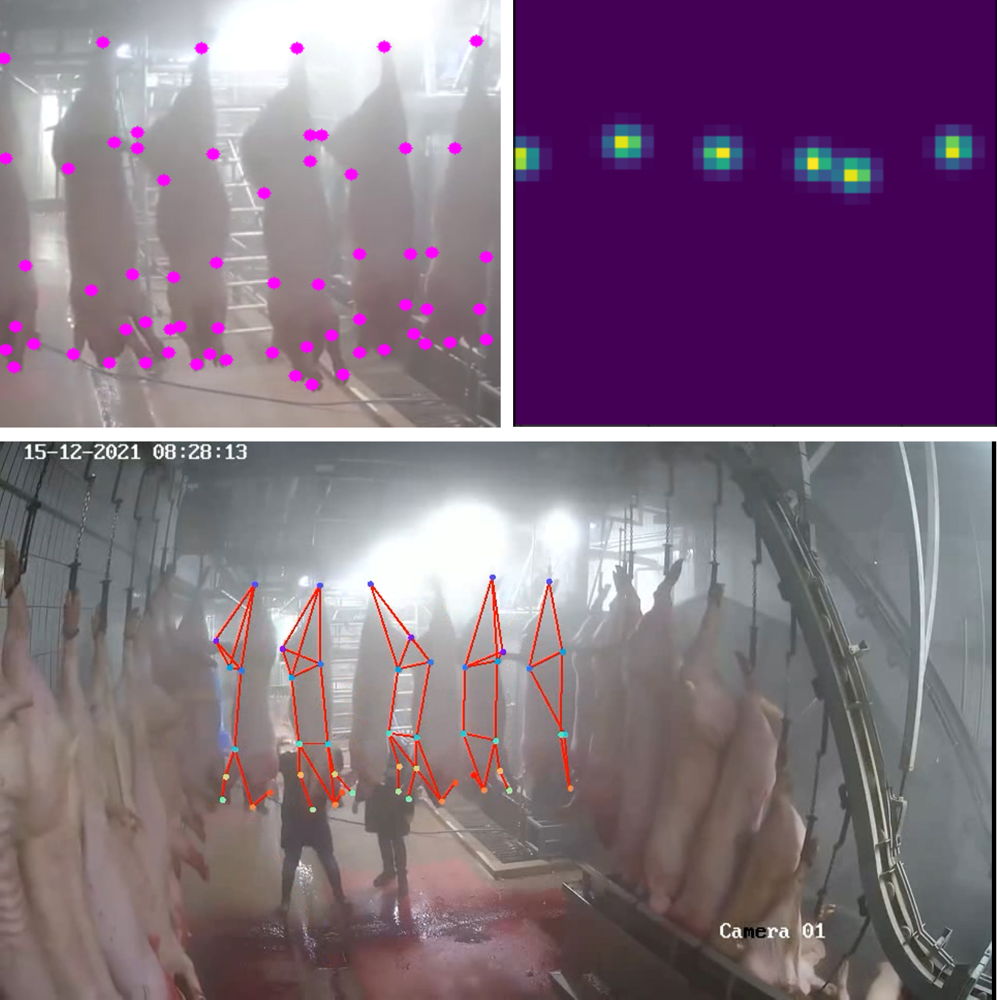
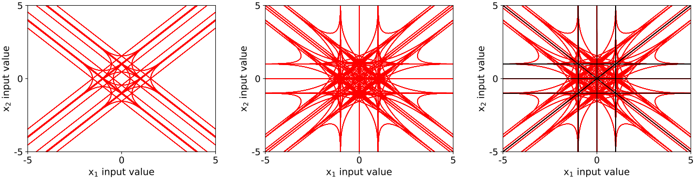
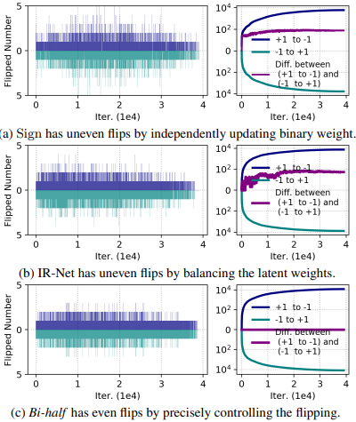

## Yunqiang Li  

Deep Learning Researcher at <a href="https://www.axelera.ai/team/">Axelera AI</a>  & Guest Researcher at <a href="http://visionlab.tudelft.nl">TU Delft. </a> 
My main research interests are Network Pruning and Network Quantization 

Before, I did my PhD at <a href="http://visionlab.tudelft.nl">Computer vision lab</a>, Delft University of Technology (TU Delft) 
My Supervisor is <a href="https://jvgemert.github.io/">Jan van Gemert</a> 

<b>Email:</b> y.li-19@tudelft.nl & yunqiang.li@axelera.ai   
<b></b> 
[Curriculum Vitae.](/YunqiangLi_Resume.pdf)
and 
<a href="https://github.com/liyunqianggyn">My Github</a> 

## News
* 04/2022, deep learning researcher at Axelera AI on Pruning & Quantization topics
* 12/2021, working for a project with deep pose estimation to detect animal keypoints 
* 12/2021, one paper was accepted by Association for the Advancement of Artificial Intelligence (__AAAI__).
* 12/2020, one paper was accepted by Association for the Advancement of Artificial Intelligence (__AAAI__).
* 07/2020, two papers were accepted by International Conference on Pattern Recognition (__ICPR__).
* 06/2019, one paper was accepted by Transactions on Multimedia (__TMM__).
* 07/2019, one paper was accepted by British Machine Vision Virtual Conference (__BMVC, oral__).

## Review
- 2022   Reviewer of European Conference on Computer Vision (ECCV)
- 2022   Reviewer of IEEE Conference on Computer Vision and Pattern Recognition (CVPR)
- 2021   Reviewer of British Machine Vision Virtual Conference (BMVC)
- 2021   Reviewer of International Conference on Computer Vision (ICCV)
- 2021   Reviewer of IEEE Conference on Computer Vision and Pattern Recognition (CVPR)
- 2021   Reviewer of Winter Conference on Applications of Computer Vision (WACV) 
- 2020   Reviewer of IEEE Conference on Computer Vision and Pattern Recognition (CVPR)
- 2020   Reviewer of International Conference on Pattern Recognition (ICPR)
- 2020   Reviewer of British Machine Vision Virtual Conference (BMVC)
- 2019   Reviewer of British Machine Vision Virtual Conference (BMVC)

## Education
* 02/2018 - Now: __Delft University of Technology (TU Delft)__, Netherlands.  
  __PhD__ candidate in <a href="http://visionlab.tudelft.nl">Computer Vision Lab</a>  
  Research area: Deep Learning and Computer Vision.
* 03/2017 - 02/2018: __Xi’an Jiaotong University (XJTU)__, China.  
  __PhD__ candidate. 
* 09/ 2014 - 12/2016: Joint education of __Xi’an Jiaotong University (XJTU) and Air force Engineering__, China.  
  __Master__ of Signal and Information Processing.  

<!-- ## Experience
- 07/2018 - 12/2019, __Tencent Youtu X-Lab__.  
  Senior Researcher.
- 07/2016 - 12/2016, __Carnegie Mellon University__.  
  Visiting Scholar in Language Technolgy Institute (LTI).  
  Supervisors: [Prof. Louis-Philippe Morency](https://www.cs.cmu.edu/~morency/) and [Dr. Tadas Baltrušaitis](https://www.cl.cam.ac.uk/~tb346/).
- 03/2013 - 08/2013, Intern at __Philips Research Eindhoven__.
 -->
<!-- ## Research Interest
- Image Synthesis
- video/image captioning
- Sequence (Time Series) Modelling
- Recurrent Neural Networks
- Attention Model
- Deep Learning
- Sequence-related applications, e.g, age estimation from facial videos
- Object Detection
- Person Re-Identification
- Hashing for Image Retrival -->

## Project 

---------------------------------------------------------------------------------------------------------------------------- 
- &emsp;__Yunqiang Li__,  Niels Ilmer, Louis Gosschalk, and Jan van Gemert.  
&emsp;"Minimizing animal welfare risks: Deep learning for animal pose estimation". 
&emsp;[<a href="https://surfdrive.surf.nl/files/index.php/s/oPoEvbLJiJDD5Yn">Report</a>, <a href="https://surfdrive.surf.nl/files/index.php/s/b3Z15xU2bEnXaJy">Some videos</a>], 2022.  
  
  
  
  
  

## Publications 

<!-- ---------------------------------------------------------------------------------------------------------------------------- 
- &emsp;Xiangwei Shi\*, __Yunqiang Li__\*, Xin Liu\*, Jan van Gemert. (\*contributed equally.) 
&emsp;"WeightAlign: Normalizing Activations by Weight Alignment" [<a href="https://arxiv.org/pdf/2010.07160.pdf">pdf</a>]. 
&emsp;International Conference on Pattern Recognition (__ICPR__), 2020.
   -->

---------------------------------------------------------------------------------------------------------------------------- 
- &emsp;__Yunqiang Li__,  Silvia L. Pintea, and Jan van Gemert.  
&emsp;"Equal Bits: Enforcing Equally Distributed Binary Network Weights" [<a href="https://arxiv.org/abs/2112.03406">pdf</a>, <a href="https://github.com/liyunqianggyn/Equal-Bits-BNN">code</a>, <a href="https://recorder-v3.slideslive.com/?share=58931&s=f97335b2-5347-43b7-8703-18dc10214319
">video</a>]. 
&emsp;Association for the Advancement of Artificial Intelligence (__AAAI__), 2022.  
  
  
  
  
  
  
  

---------------------------------------------------------------------------------------------------------------------------- 
- &emsp;__Yunqiang Li__ and Jan van Gemert.  
&emsp;"Deep Unsupervised Image Hashing by Maximizing Bit Entropy" [<a href="https://arxiv.org/pdf/2012.12334.pdf">pdf</a>, <a href="https://github.com/liyunqianggyn/Deep-Unsupervised-Image-Hashing">code</a>]. 
&emsp;Association for the Advancement of Artificial Intelligence (__AAAI__), 2021.  
  
  
  

---------------------------------------------------------------------------------------------------------------------------- 
- &emsp;Xiangwei Shi\*, __Yunqiang Li__\*, Xin Liu\*, Jan van Gemert. (\*contributed equally.) 
&emsp;"WeightAlign: Normalizing Activations by Weight Alignment" [<a href="https://arxiv.org/pdf/2010.07160.pdf">pdf</a>]. 
&emsp;International Conference on Pattern Recognition (__ICPR__), 2020.
  
  

---------------------------------------------------------------------------------------------------------------------------- 
- &emsp;Xiangwei Shi, Seyran Khademi, __Yunqiang Li__, Jan van Gemert. 
&emsp;"Zoom-CAM: Generating Fine-grained Pixel Annotations from Image Labels" [<a href="https://arxiv.org/pdf/2010.08644.pdf">pdf</a>]. 
&emsp;International Conference on Pattern Recognition (__ICPR__), 2020.
  
  

---------------------------------------------------------------------------------------------------------------------------- 
- &emsp;__Yunqiang Li__, Wenjie Pei, Yufei Zha and Jan van Gemert.  
&emsp;"Push for Quantization: Deep Fisher Hashing" [<a href="https://arxiv.org/pdf/1909.00206.pdf">pdf</a>, <a href="https://github.com/liyunqianggyn/Push-for-Quantization-Deep-Fisher-Hashing">code</a>]. 
&emsp;British Machine Vision Conference (__BMVC__) Oral, (4.7% acceptance rate), 2019.  

---------------------------------------------------------------------------------------------------------------------------- 
- &emsp;Yufei Zha, Tao Ku,  __Yunqiang Li__, Peng Zhang.  
&emsp;"Deep Position-Sensitive Tracking" [<a href="https://ieeexplore.ieee.org/abstract/document/8734874">pdf</a>]. 
&emsp;IEEE Transactions on Multimedia (__TMM__), 2019.  

  

